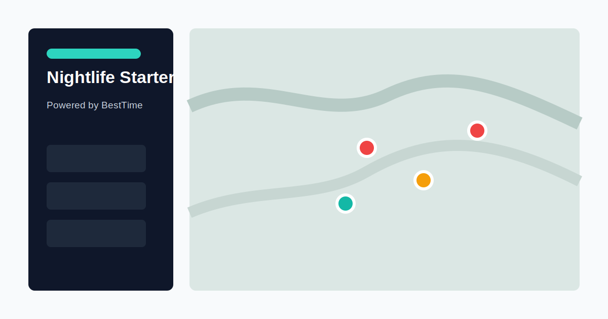

# BestTime Nightlife App Starter

A Vercel-ready Next.js starter for building consumer venue-discovery apps with [BestTime](https://besttime.app) foot traffic data.

The app works immediately in demo mode with bundled New York fixture data across nightlife, cafes, shopping, and popular venues. Add `BESTTIME_API_KEY` to switch to live BestTime API data through server-side proxy routes.



## Features

- Map-first venue discovery experience.
- Responsive desktop and mobile web UI.
- MapLibre 3D map using open map tiles.
- Demo mode without an API key.
- Live mode with server-side BestTime API proxy.
- Venue detail pages with weekly foot traffic heatmaps.
- SEO-friendly city and venue pages.
- PWA-ready manifest and icon.
- Starter admin page with local browser settings.
- Subtle visible BestTime attribution links.

## Local Setup

```bash
npm install
cp .env.example .env.local
npm run dev
```

Open `http://localhost:3000`.

## Demo Mode

If `BESTTIME_API_KEY` is empty, the app uses bundled NYC fixture data and shows a demo data status. The fixture includes 1,000 real public venue forecasts generated from a read-only BestTime production slice: 250 primary venues each for cafes, nightlife, shopping, and popular discovery, with current live busyness values where available.

## Live BestTime Mode

Add your private BestTime key to `.env.local`:

```dotenv
BESTTIME_API_KEY=pri_your_key_here
```

Restart the dev server. The browser still only calls local `/api/besttime/*` routes. The private key stays on the server.

## Admin Protection

`/admin` works without a password for local demos, but it shows a warning modal. Before sharing a deployment, configure:

```dotenv
ADMIN_PASSWORD=choose-a-password
```

## Vercel Deployment

1. Import this repository into Vercel.
2. Set `BESTTIME_API_KEY` in Vercel Project Settings if you want live data.
3. Set `ADMIN_PASSWORD` before sharing the deployment.
4. Deploy.

Optional public settings:

```dotenv
NEXT_PUBLIC_SITE_URL=https://your-domain.vercel.app
NEXT_PUBLIC_DEFAULT_CITY=new-york
NEXT_PUBLIC_DEFAULT_CATEGORY=nightlife
NEXT_PUBLIC_DEFAULT_RESULT_LIMIT=24
NEXT_PUBLIC_INDEX_PUBLIC_PAGES=true
NEXT_PUBLIC_ATTRIBUTION_MODE=subtle
```

## SEO And Attribution

The starter includes sitemap, robots, metadata, canonical URLs, Open Graph data, and fixture venue JSON-LD. BestTime links are visible and normal links in the footer, venue data source rows, this README, and `/about-data`.

## Milestone 1 Deferrals

This starter intentionally does not include database persistence, user accounts, billing, collection management, Google Places autocomplete, AI filter generation, or non-Vercel deployment targets.
